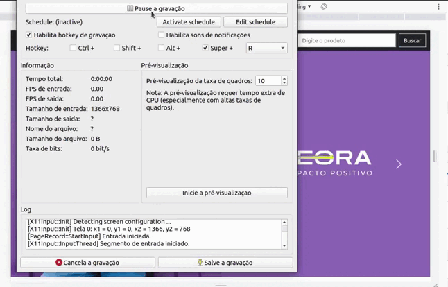

# Meteora

## Sobre:

O repositório "Meteora" contém um projeto web desenvolvido utilizando o framework de estilos Bootstrap. Este projeto foi criado com o objetivo de reproduzir uma loja virtual de roupas chamada Meteora, com diversas páginas e elementos interativos.

O projeto é composto por diversas páginas HTML que utilizam o Bootstrap para estilização e organização do conteúdo, de forma responsiva e adaptável a diferentes dispositivos. O Bootstrap foi a framework de estilos utilizada para a criação dos estilos, proporcionando uma abordagem de desenvolvimento mais eficiente e rápida.

## Layout:



## Como executar o projeto?

Os passos para acessar o projeto são bem simples, mas seguem a seguinte ordem:

```bash
# Terminal

git clone https://github.com/MateusMaciel340/meteora

cd meteora/

```

## Tecnologias

As seguintes ferramentas foram utilizadas na construção do projeto:

### Frontend

- HTML
- CSS
- Bootstrap

## Contribuidores

<table>
    <thead>
        <tr>
            <td>
                
            </td>
        </tr>
    </thead>
    <tbody>
        <tr>
            <th>Mateus Maciel</th>
        </tr>
    </tbody>
</table>

## Como contribuir?

1. Faça um fork do projeto.
2. Crie uma nova ramificação com suas alterações: `git checkout -b minha-feature`
3. Salve as alterações e crie uma mensagem de confirmação contando o que você fez: `git commit -m "arquivo modificado"`
4. Envie suas alterações: `git push origin minha-feature`

## Licença

Este projeto é licenciado sob a licença Alura Cursos.
